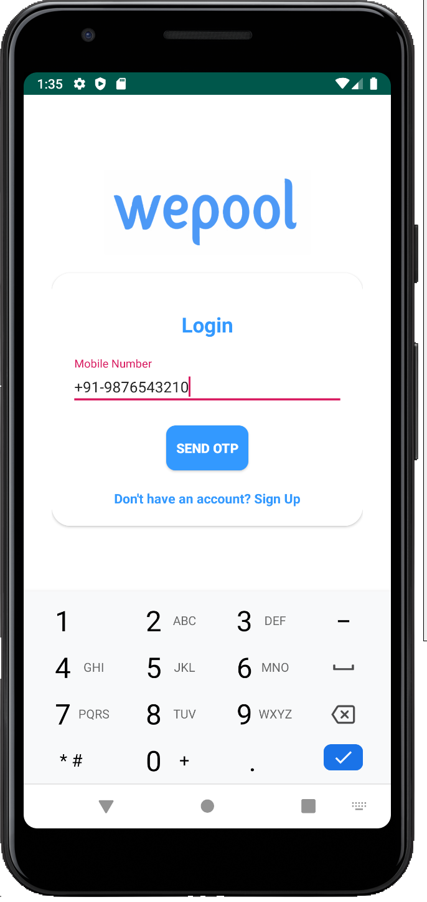
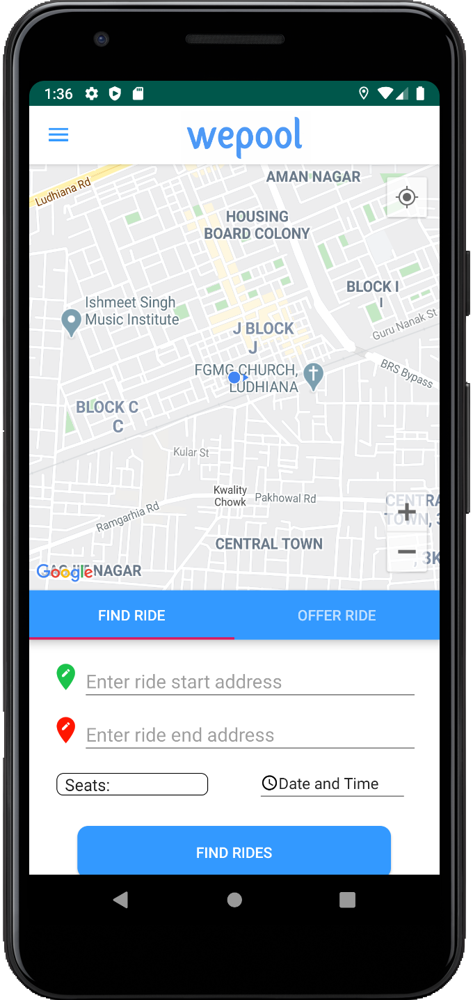
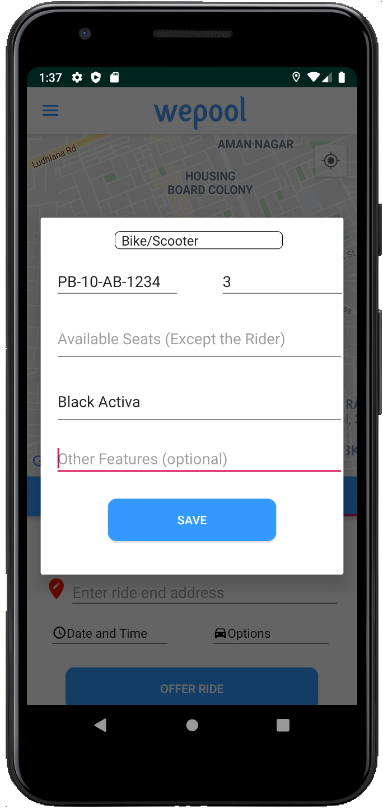
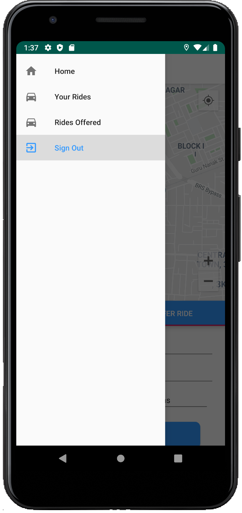

# Ride With Me

RideWithMe is a carpooling app bringing students together to provide carpool services, giving them a cheaper and safer way to travel to college than public transport, and a convenient way to those who walk to the college campus.

Want to be a part of this project?  [Hit me up!](mailto:tanmay.madaan@verdin.in)

 
